# Processing, Analyzing, and Modeling Sport Sensor Data

This directory contains the R script files and their accompany parameter files that are developed by Microsoft to process, analyze, and model sport sensor data. The R scripts have been generalized to analyze and model your own data, which might have different column names, different number of sensors, etc, with the data we collected from the ski sensory data. You only need to customize the the parameter file for each R script file, before you run the R script file. 

The ski sensory data we collected can be downloaded [here (please provide the link here after uploading to Azure blob)](). If you want to try the R script files out first on the ski sensory data to see how these R script files work, please download it first to your local machine, and update the path to this data file in the Enhance_Sensor_Data. 

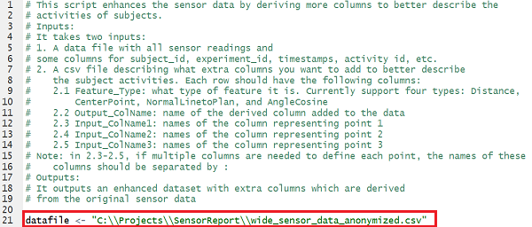

Then, take the following steps to process, analyze, and model the sport sensor data. 

## Step 1. Enhance the sport sensor data by deriving extra variables from raw sensor readings

It is very likely that the sport sensors are only measuring the position, line speed, acceleration, or rotation of joints of some body parts when the athletes are executing some actions. However, sometimes, some variables that are describing the relative position/angle between two body parts or planes might be more meaningful for some sports. For instance, for ski, variables that are measuring the distance between two feet, the angles between upper and lower trunk planes might be very informative in describing how different body parts are coordinating together when completing a task. 

To specify what extra variables you want to derive from the raw sensor readings, you need to customize the text file _DerivedSensors.csv_. File _DerivedSensors.csv_ should have the following columns. 

- Feature\_Type: This column specifies what type of feature to calculate. Currently, we support four different values: Distance, CenterPoint, NormalLinetoPlane, and AngleCosine. 

	- Distance: To calculate Euclidean distance between two body parts, you need to provide column names in _Input\_ColName1_ and _Input\_ColName2_. If the distance is just the distance in 1-D space, such as just along x-axis, the _Input\_ColName1_ and _Input\_ColName2_ should be just two single column names of the same axis of the two body parts. If the distance is in n-D space (n=2 or 3), the column names corresponding to body part 1 coordinates should be concatenated into a single string, separated by ':', and assigned to the value of _Input\_ColName1_. We should do the same thing to the coordinates of the body part 2 and assign the string to column _Input\_ColName2_. Make sure that the coordinates of both parts are in the same order. 
	
	- CenterPoint: To calculate the center point between two body parts on a certain axes, you need to provide column names in _Input\_ColName1_ and _Input\_ColName2_. 

	- NormalLinetoPlane: To calculate the normal line to a plane, spanned by three points, you need to provide the coordinates (x, y, and z) of the three points to columns _Input\_ColName1_, _Input\_ColName2_, and _Input\_ColName3_. In each of these three columns, the column names of the x, y, and z axis of the same point should be concatenated into a single string, separated by ':'. Make sure that the coordinates of all three points are in the same order.

		In this example of ski sensor analysis and modeling, normal lines to both upper trunk plane (spanned by left and right shoulders and pelvis) and lower trunk plane (spanned by left and right lower legs and pelvis) are calculated. The normal lines are depicted as follows:

		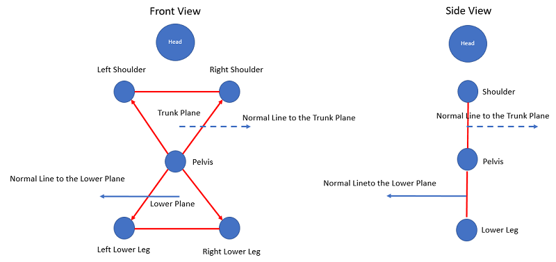

	- AngleCosine: To calculate the angles between two 3-D vectors, you need to provide the coordinates (x, y, and z) of the two 3-D vectors to columns _Input\_ColName1_ and _Input\_ColName2_. In each of these three columns, the column names of the x, y, and z axis of the same point should be concatenated into a single string, separated by ':'. Make sure that the coordinates of both vectors are in the same order. 

		In this example of ski sensor analysis and modeling, the cosine of the angle between the upper and lower trunk planes are calculated via calculating the cosine between the normal lines to these two planes. The following picture depicts the conditions when the cosine will be negative, zero, and positive. Clearly, when the athletes are more back sitting, the cosine value will be more toward the negative side. When the athletes are more crouching, the cosine value will be more toward the positive side. 

		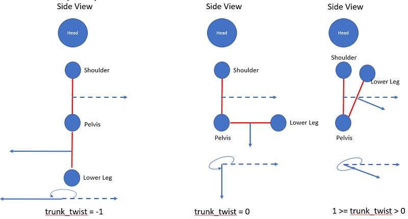

- Output\_ColName: This column specifies the output variable name(s) for the feature to be derived. For every derived feature with feature type _Distance_, _CenterPoint_, and _AngleCosine_, there is a single variable derived for each row in _DerivedSensors.csv_ file. The only exception is feature type _NormalLinetoPlane_, where three variables will be generated, with names _<Output\_ColName>\_x_, _<Output\_ColName>\_y_, and _<Output\_ColName>\_z_.

- Input\_ColName1, Input\_ColName2, and Input\_ColName3: Names of columns used to derive the desired features. 

If some of the derived features (d2) are depending on some other derived features (d1), you need to make sure that the definition of the d1 features appear earlier than d2 features in the _DerivedSensors.csv_ file. 

After you customize the _DeriveSensors.csv_ file, update the R script file _Enhance\_Sensor\_Data.R_ with the path to this file. 

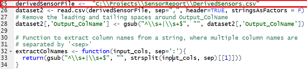

You may also want to remove the comments in the last two lines of the R script file _Enhance\_Sensor\_Data.R_ and specify the destination csv file that you can write the enhanced sensor data to. The future feature engineering and data aggregation will be directly on the enhanced sensor data. 

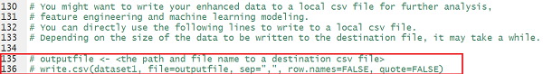

Then, you can run the R script file _Enhance\_Sensor\_Data.R_ to derive the extra columns. After it completes running, you are ready to move to the next step to aggregate data and generate features for machine learning models. 

## Step 2. Aggregate raw enhanced sensor data to generate features

In this version of sensor data analysis and modeling, we split the data collected during each experiment into multiple ~2-second segments, and statistics in each segment are extracted to characterize the activities of athletes. For machine learning task, we also label each segment with the label of the entire experiment. There are several benefits of splitting the entire experiment into segments:

- It significantly increases the number of training instances. In sports analysis, it is usually very expensive to collect the data from athletes, especially when the athletes are required to wear some devices or sensor suits when executing the activities. Splitting the data in each experiment into _N_ segments will enlarge the number of training instances by _N_ times. 

- It allows us to understand the activities of athletes in different stages of the experiment, a better granularity than just at the experiment level. After splitting the data into segments, we can investigate at what stage the athletes can be improved. We can also correlate the segments with the other variables such as the curve of the tracks in ski sports so that we can know whether the athletes have good control on sharp or smooth curves. 

You need to customize the _feature\_dict.csv_ file, a _JSON_ formatted text file, so that the R script file _SensorData\_Feature\_Engineering.R_ can generate features on your sensor data, which might have different schema as the data we collected for ski sports. 

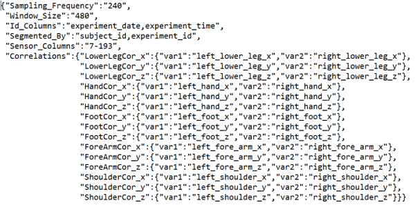

The _feature\_dict.csv_ JSON file should have the following fields:

- Sampling\_Frequency: This field describes how many points the sensor is generating each second. It assumes that that all sensors have the same sampling frequency. If different sensors have different sampling frequencies, high-frequency sensors should be down sampled, or values should be interpolated for low-frequency sensors, so all sensors readings will have the same sampling frequency. 

- Window\_Size: number of observations in each window that is defined to split the data in each experiment into multiple segments. 

- Id\_Columns: columns that you want to add to the feature set that can be used to identify each window. In this ski sports example, we add _experiment\_date_ and _experiment\_time_ to the feature set so that later on we know the time for each window. It can be used as the time mark in the other data sources, like video clips, so that we can easily find evidences in the video frames that can explain the activities measured by sensors. Multiple _Id\_Columns_ should be separated by ",". 

- Segmented\_By: columns that are used to slice and dice the sensor data. For observations belonging to a single unique combination of the columns specified here, the observations are further split into windows, and features in each window are extracted. For instance, in the ski sports data, the data is sliced and dices by _subject\_id_ and _experiment\_id_. 

- Sensor\_Columns: indices of sensor columns (1-based) that you want to extract features from. You can use "," to specify the columns, and use "-" to specify a range of indices. 

- Correlations: In addition to the features extracted for each individual sensor, we also allow you to specify what correlations between two sensor columns in each window you want to calculate. It takes a JSON structure as the value. The JSON structure should specify:

	
	- Output correlation name. 
	- Names of variable 1 (_var1_) and variable 2 (_var2_) that you want to calculate the correlations. 

After you have the _feature\_dict.csv_ customized, you should update the R script file _SensorData\_Feature\_Engineering.R_ with the location of the source sensor data, the _feature\_dict.csv_, and the output feature set file, before you run the R script file. 

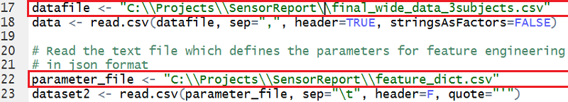
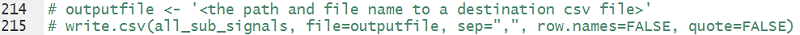

## Step 3. Analyze the feature set and train a logistic regression model. 
The R script file _Feature\_Analysis\_Modeling.R_ has the following functions:

- It ranks the features by the strength of the linear relationship with the target columns, and prints out the top _N_ most related features. 

- It plots the box plots of the top _M_ most related features. These plots can help you understand how the different groups of observations (grouped by the different levels of the target variable) differ on each of the top _M_ features. For instance, in the ski sports sensor data, you will be able to observe that for professional skiers, their feet are significantly closer than the intermediate skiers. 

- It builds a logistic regression model with L1 regularization (LASSO) to classify observations as from professional or intermediate athletes. It predicts the observations in the validation data, and outputs the accuracy on the validation dataset. 

You need to customize the _parameters\_dict.csv file in order to fit your own data. The _parameters\_dict.csv file is a JSON formatted text file with the following fields:

- Label\_Column: the name of the column in the feature dataset that you are going to use to train the machine learning model. In the ski sports sensor data, we want to build a machine learning model to classify professional and intermediate skiers. We know the skiers' names and their _SkillLevels_. The original feature set only has the skiers' anonymized name 'Pro1', 'Pro2', and 'Intermediate1', but not the _SkillLevel_ column. So, in the R script file _Feature\_Analysis\_Modeling.R_, we add the following lines to generate the label column _SkillLevel_ from the column _subject\_id_.

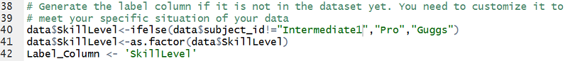

- Feature\_Column: the indices of feature columns you would like to consider in this analysis and modeling. You can use "," to specify the columns, and use "-" to specify a range of indices.

- Top\_N\_Columns: the number of features with the strongest linear relationship with the target column you would like to pick up for modeling. 

- Top\_N\_Columns: the number of features with the strongest linear relationship with the target column that you would like to plot the box plot to help you understand how these feature differentiate the target variable. 

- Parameters: a JSON structure that specifies the parameters for the logistic regression model with L1 regularization. _Alpha=1_ stands for L1 regularization in the _glmnet_ model. _Lambda=0.01_ specifies how strongly you want to suppress the coefficients of the model. See [glmnet](ftp://debian.ustc.edu.cn/CRAN/web/packages/glmnet/glmnet.pdf) for more detailed descriptions of these parameters. 

After you customize the _parameters\_dict.csv_ file, you need to modify the following lines in the _Feature\_Analysis\_Modeling.R_ file to specify the locations of the feature set file, and the _parameters\_dict.csv_ file. Then, you should be able to run the R script file to analyze and visualize the features, and train a logistic regression model. 

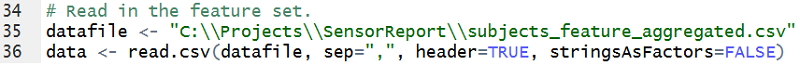
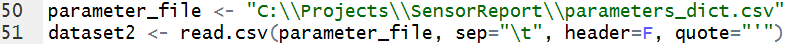